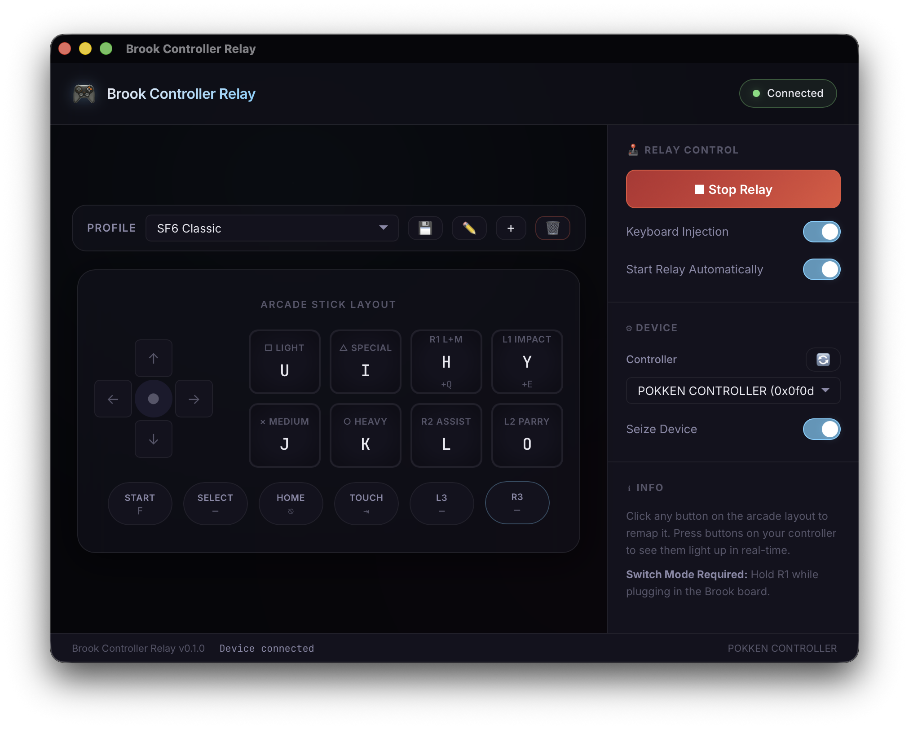
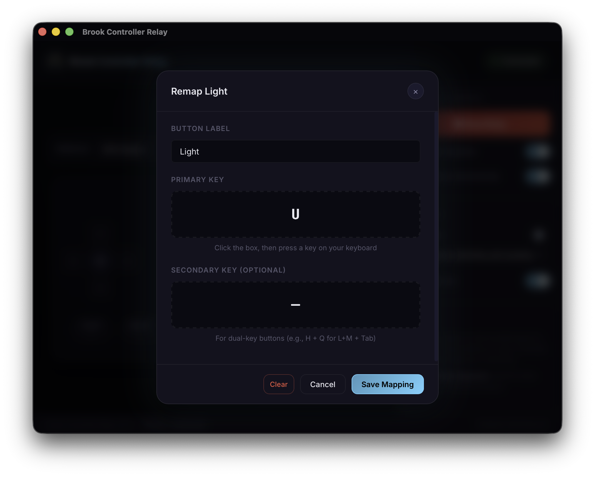

# Brook Controller Relay

A macOS app that lets you use a **Brook Gen-5X Fighting Board** (or any HID controller) with **CrossOver/Wine** games like Street Fighter 6 — bypassing Apple Silicon's broken USB controller support.

<p align="center">
  
</p>

<p align="center">
  
</p>

## The Problem

macOS on Apple Silicon has **two showstopper bugs** for third-party USB controllers:

1. **XInput mode drops inputs** — macOS claims XInput (Xbox) devices but silently drops input from non-first-party controllers on Apple Silicon.
2. **PS5 mode crashes** — macOS sends advanced DualSense haptic/LED commands that the Brook board can't handle, causing it to crash every ~6 seconds.
3. **CrossOver can't see controllers** — Even in Switch mode (the only stable boot mode), CrossOver/Wine has no way to read HID devices that macOS has already claimed.

**Result:** Your arcade stick is invisible to the game. No existing driver, mapping tool, or Wine configuration fixes this.

## The Solution

Brook Controller Relay works around all of this:

1. **Seizes the HID device** — Uses IOKit's `kIOHIDOptionsTypeSeizeDevice` to take exclusive control, preventing macOS from interfering.
2. **Reads raw HID reports** — Parses the 8-byte reports directly from the Brook board in Switch mode.
3. **Injects keyboard events** — Translates each button press into macOS `CGEvent` keyboard events that CrossOver/Wine sees as native input.

The game thinks you're pressing keys on a keyboard. It's fast, reliable, and frame-perfect.

## Setup

### Prerequisites

- macOS (Apple Silicon or Intel)
- [Rust](https://rustup.rs/) (1.96+)
- [Node.js](https://nodejs.org/) (18+)

### Install & Run

```bash
# Clone the repo
git clone https://github.com/your-user/brook-controller-relay.git
cd brook-controller-relay

# Install frontend dependencies
npm install

# Run the app
npm run tauri dev
```

### Build for Distribution

```bash
npm run tauri build
```

The `.dmg` will be in `src-tauri/target/release/bundle/dmg/`.

## Usage

### 1. Boot the Brook Board in Switch Mode

**Hold R1 while plugging in the USB cable.** This boots the Brook Gen-5X in Nintendo Switch mode (`VID: 0x0f0d, PID: 0x0202`), which is the only mode that doesn't crash or drop inputs on macOS.

### 2. Select Your Device

Open the app, go to the **Device** section on the right sidebar, and select your controller from the dropdown. Click 🔄 to refresh the list.

### 3. Start the Relay

Click **▶ Start Relay**. The status will change to "Connected" when the controller is detected. Press buttons on your arcade stick — you'll see them light up in real-time.

### 4. Configure Mappings

Click any button on the arcade layout to remap it. The default profile is set up for **Street Fighter 6 Classic Controls**:

| Button | Key | Action |
|--------|-----|--------|
| □ Light | U | Light Attack |
| × Medium | J | Medium Attack |
| ○ Heavy | K | Heavy Attack |
| △ Special | I | Special |
| L1 Impact | Y + E | Drive Impact + Tab→ |
| R1 L+M | H + Q | Light+Medium + Tab← |
| L2 Parry | O | Drive Parry |
| R2 Assist | L | Assist |
| D-Pad | W/A/S/D | Movement |
| Start | F | Start |
| Select | Tab | Select |
| Home | Escape | Home/Pause |

## Features

- **Device picker** — Auto-detects connected HID controllers, no manual VID/PID entry
- **Profiles** — Create, rename, and switch between mapping profiles
- **Live preview** — See button presses light up in real-time on the arcade layout
- **Key remapping** — Click any button to reassign keys via an interactive picker
- **Seize mode** — Exclusive device access prevents macOS from interfering
- **Auto-start** — Optionally start the relay automatically when the app opens
- **Keyboard injection toggle** — Pause key output without stopping HID listening

## Tech Stack

- **Frontend:** Vanilla HTML/CSS/JS
- **Backend:** Rust (Tauri v2)
- **HID:** IOKit FFI (raw C bindings, no hidapi crate — needed for `SeizeDevice`)
- **Key Injection:** `CGEventCreateKeyboardEvent` via Core Graphics FFI

## License

MIT
